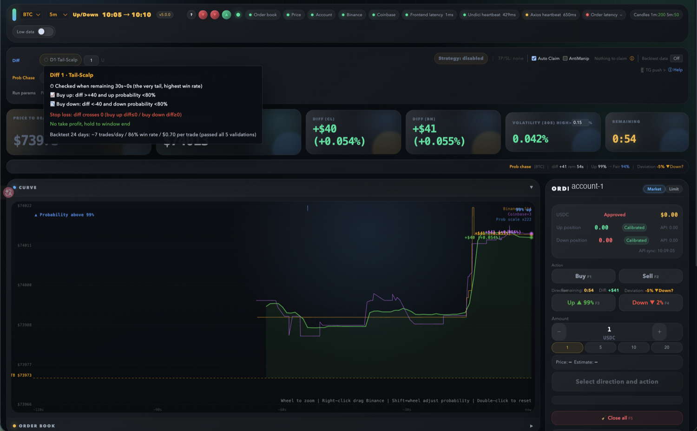
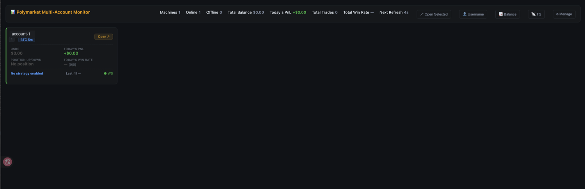

# BTC 5m — Quick Order Tool & Automated Strategy Framework

> A quick-order tool and automated strategy framework for Polymarket's **BTC 5-minute up/down** market.


Run it fully locally for fast manual trading with helper overlays, or deploy it to a cloud server for low-latency, 24/7 automated trading. It connects to multiple upstream WebSockets (Polymarket order book / Chainlink price / Binance reference price) and shows the live order book, price trends, positions, and an order panel — with a pluggable strategy system for automation.

**Multi-market by design:** the data layer supports **BTC / ETH / SOL** across **5m / 15m** windows (6 markets, switchable from the UI), and adding a new symbol is a one-line config change. The bundled example strategies target BTC 5m; other markets are ready for your own strategies (thresholds differ a lot per coin, so they shouldn't be blindly reused).



> _Main dashboard (full mode): live order book, strategy tooltip, probability & price curves, and the order panel._

---

## Table of Contents

- [Why this tool](#why-this-tool)
- [Features](#features)
- [Quick Start](#quick-start)
- [Project Structure](#project-structure)
- [Strategies](#strategies)
- [API](#api)
- [Cloud Deployment](#cloud-deployment)
- [Security](#security)
- [Contributing](#contributing)
- [Support this project](#support-this-project)
- [License](#license)

---

## Why this tool

| | Polymarket Official | This Tool |
|---|---|---|
| **Order flow** | Wallet signature required every time, easy to miss the moment | Credentials auto-cached after the first signature, one-click order |
| **Price reference** | Chainlink oracle price only | Also shows Binance real-time price, faster reaction |
| **Data visualization** | Probability numbers only | Probability curve + Binance price curve + diff comparison |
| **Automated trading** | None | Modular strategy framework, fully automated execution of custom strategies |
| **Deployment** | Browser only | Local run / cloud server, 24/7 unattended |

> ⚠️ **Disclaimer:** The built-in strategies are framework examples only and **cannot guarantee profits**. Develop and tune your own strategies based on your own analysis. Trading involves risk; you are solely responsible for any losses.



> _Multi-account monitor: track balance, PnL, win rate, and live status across multiple instances at a glance._

---

## Features

### ⚡ Quick Order
- After the first private-key signature, API credentials are auto-cached — no repeated signing
- FOK (fill-or-kill) market orders, avoiding resting-order risk
- One-click buy up / buy down from the panel, with slippage settings

### 🌐 Multi-Market
- **BTC / ETH / SOL** × **5m / 15m** = 6 markets, switchable from the UI
- Data-driven config (`market-configs.ts`) — add a new symbol/period in one entry
- Per-coin price precision handled automatically (BTC integer, SOL 4 decimals, etc.)
- Built-in strategies target BTC 5m; other markets are ready for your own strategies

### 📊 Real-Time Data
- Four parallel WebSockets: Polymarket order book, Chainlink oracle, user fills, Binance real-time price
- Binance price reacts faster than the Chainlink oracle, providing a leading signal
- Automatic price-offset calibration (MAD outlier filtering + trimmed mean)
- Automatic market-window switch (every 5m / 15m depending on the market)

### 🧩 Strategy Framework
- Each strategy is a single file under `strategies/`, implementing a unified interface
- Add a strategy: drop in a file → restart, and the frontend shows it automatically
- Strategy parameters carry comments; frontend hover descriptions are generated automatically
- Supports both **market** and **limit (maker)** order strategies
- Multiple entries per round (count configurable, persisted)
- Trade records saved automatically, with entry/exit reasons and PnL details

### 🖥 Frontend Panel (Dual Mode)
- **Full mode** — Complete dashboard: order-book depth, probability/price curves, manual order panel, strategy controls, trade records — for manual trading and monitoring
- **Low mode** — Lean panel for automation: core data (probability/diff/countdown) + strategy status + trade records, low bandwidth — for unattended running and mobile viewing
- Toggle strategy switches, amounts, and per-round counts in real time
- Auto-claim of expired positions

### 🔬 Data Collection & Backtesting
- One-click backtest data collection from the frontend
- Records diff, probability, time remaining, and other key metrics every second
- Companion Python analysis script with parameter-sweep optimization (multi-core)

---

## Quick Start

### Requirements
- Node.js **20+**

### Install
```bash
npm install
```

### Configure
```bash
cp .env.example .env
```

**Required:**
- `POLYMARKET_PRIVATE_KEY` — Polygon private key (auto-generates API credentials on first run)
- `POLYMARKET_PROXY_ADDRESS` — Polymarket proxy wallet address (**not the deposit address**; log in to polymarket.com → top-right avatar → Settings → Wallet → copy "Proxy Wallet", which maps one-to-one with the private key; a wrong value triggers `invalid signature`)

**Optional:**
- `APP_MODE` — `full` (with panel) or `headless` (API only)
- `STRATEGY_<KEY>_ENABLED` / `STRATEGY_<KEY>_AMOUNT` — strategy switch and amount (KEY is the uppercase strategy name, e.g. `D1`, `P1`, `P2`)
- `ORDER_DEFAULT_SLIPPAGE` — default slippage
- `AUTO_CLAIM_ENABLED` — auto-claim expired positions

### Run
```bash
# macOS / Linux
./start.sh

# Windows
start.bat

# or
npm start
```

Then open **http://localhost:3456**

---

## Project Structure

```
├── server.ts              # Backend service (Express + WebSocket, port 3456)
├── index.html             # Frontend panel
├── strategies/            # Strategy modules (plugin-based: add/remove files, no registry edits)
│   ├── types.ts           # Shared types and the IStrategy interface
│   ├── registry.ts        # Strategy registry (driven by _runtime/loader)
│   ├── _runtime/          # Dynamic loader
│   ├── _core/             # Shared core logic (fair-prob / momentum factors)
│   ├── d1.ts              # Diff-based
│   └── p1.ts, p2.ts       # Prob-chase
├── backtest-data/         # Backtest data (generated at runtime)
├── .env.example           # Environment variable template
├── start.sh               # macOS/Linux launch script
└── start.bat              # Windows launch script
```

---

## Strategies

### Built-in

| Key | Name | Logic Summary |
|-----|------|---------------|
| **D1** | Diff 1 · Tail Sweep | large-diff entry at the window tail, diff-cross-0 stop-loss, holds to settlement |
| **P1** | Prob-Chase 1 | fair-prob table lookup, entry when probability lags the diff, reverse ±5 stop-loss |
| **P2** | Prob-Chase 2 · End-Game Crossing | rem 90~30s crossing entry + bias/probability filter, reverse ±5 stop-loss |

Each strategy file has full parameters and comments at the top; hover over the strategy name in the UI to see its detailed rules.

### Add your own (plugin-based)

Create a file under `strategies/` whose name matches `<letter-prefix><number>.ts` (e.g. `d3.ts`, `x1.ts`) and export a class implementing `IStrategy`. After restarting, the dynamic loader registers it automatically and the frontend generates the UI for it.

```ts
// strategies/x1.ts example
import type { IStrategy, StrategyTickContext, EntrySignal, ExitSignal } from "./types.js";

export default class X1 implements IStrategy {
  readonly key = "x1";
  readonly number = 1;
  readonly name = "My Strategy";
  getDescription() { return { key: this.key, number: this.number, name: this.name, title: "X1", lines: [] }; }
  updateGuards(_ctx: StrategyTickContext) {}
  checkEntry(_ctx: StrategyTickContext): EntrySignal | null { return null; }
  checkExit(_ctx: StrategyTickContext): ExitSignal { return null; }
  resetState() {}
  getStatePayload() { return {}; }
}
```

To remove a strategy, just delete its file — no registry changes needed.

Prefixes: `d` diff · `p` prob-chase · `t` trend · `l` limit-order (maker) · `m` momentum (reserved).

See **[strategies/STRATEGY-GUIDE.md](strategies/STRATEGY-GUIDE.md)** for the full development guide, including how to build limit-order (maker) strategies.

---

## API

| Method | Path | Description |
|--------|------|-------------|
| `GET`  | `/api/state` | Full state snapshot |
| `GET`  | `/api/strategy/descriptions` | Strategy descriptions |
| `POST` | `/api/strategy/config` | Update strategy config |
| `POST` | `/api/order` | Manual order |
| `POST` | `/api/claim` | Claim expired positions |
| `POST` | `/api/backtest/toggle` | Toggle backtest data collection |

---

## Cloud Deployment

After uploading the project to your server, configure and start it as above. Keep it running in the background with `screen`:

```bash
screen -S btc5m
npm start
# press Ctrl+A then D to detach
```

Access the panel securely via an SSH tunnel (do **not** expose the port publicly):

```bash
ssh -L 3456:127.0.0.1:3456 username@server_ip
```

Then open **http://127.0.0.1:3456** in your local browser.

---

## Security

**Private key & credentials**
- The private key lives only in your local `.env` and is never uploaded anywhere
- API credentials are derived from it and cached to `.polymarket-creds.json` for reuse
- Both are excluded via `.gitignore`

**Network access**
- The service listens on `localhost:3456`, accessible only from the local machine
- **Never expose the port directly to the public internet** — anyone who can reach it can place orders via the API
- Always use an SSH tunnel for remote access

**Fund safety**
- Test with the smallest amount first; scale up only after confirming the behavior
- Strategy switches and amounts can be adjusted from the frontend at any time
- Built-in strategies are examples only and are not investment advice

**Never share or commit these files:**

| File | Contents |
|------|----------|
| `.env` | Private key and wallet address |
| `.polymarket-creds.json` | API credentials |
| `.strategy-config.json` | Persisted config |

---

## Contributing

The tool provides a complete strategy framework and backtesting capability, but good strategies need continuous iteration. Contributions and ideas are very welcome — especially if you:

- Have better entry/exit ideas or have discovered new data patterns
- Want to do strategy backtesting and optimization together
- Want to **build more powerful features on top of this project** (forks encouraged!)
- Have any thoughts on the Polymarket BTC 5-minute market

Open an issue / PR, or reach out directly — let's achieve a 1+1 > 2 effect.

---

## Support this project

This project is free and open source. If you find it useful, here are a few ways to support it — all cost you nothing and mean a lot:

- ⭐ **Star this repo** — it helps more people discover the project and keeps me motivated to maintain it
- 🔗 **Sign up for Polymarket via my referral link** — directly supports continued development:
  ### 👉 https://polymarket.com/?r=yue188888x
- 🛠 **Build on top of it** — fork it and create something more powerful; I'd love to see what you make
- 🤖 **Prefer copy-trading?** If you'd rather follow trades than run your own strategies, try **Kreo** — a copy-trading Telegram bot ([@kreoapp](https://x.com/kreoapp)). Tap to open it in Telegram: **https://t.me/KreoPolyBot?start=ref-188888x**
- 📈 **Trade crypto & RWAs?** Check out **Variational (Omni)** ([@variational_io](https://x.com/variational_io)) — a trading platform for crypto, RWAs, and more (recently raised $50M). Trade and earn points along the way: **https://omni.variational.io/?ref=OMNI88888**
- 🐦 **Get in touch** — questions, ideas, or collaboration on X (Twitter): **[@x_188888_x](https://x.com/x_188888_x)**

Thank you for supporting open source! 🙏

---

## License

MIT — for personal use and learning/research. The risk of using this tool for trading is borne solely by the user.
